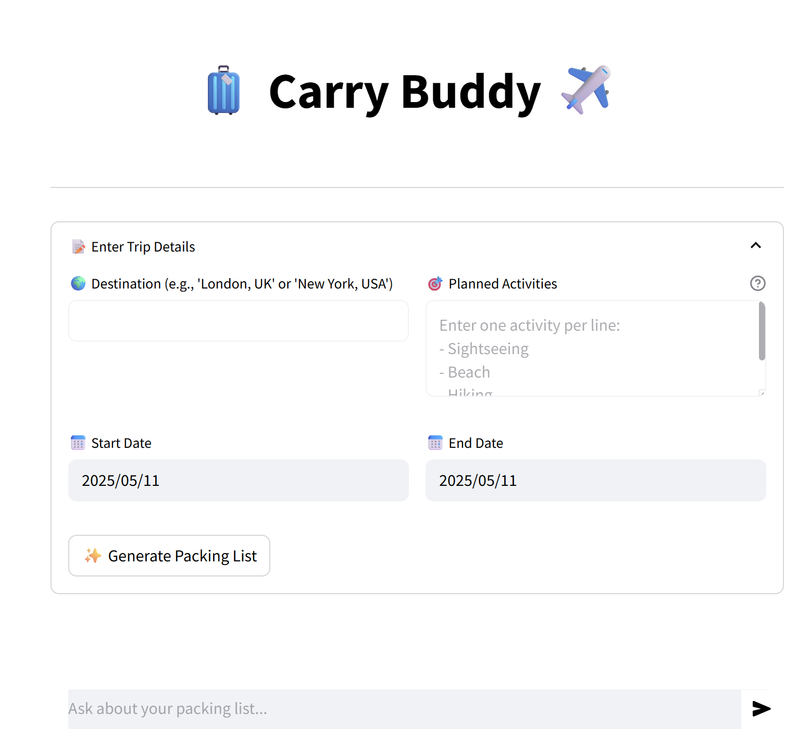
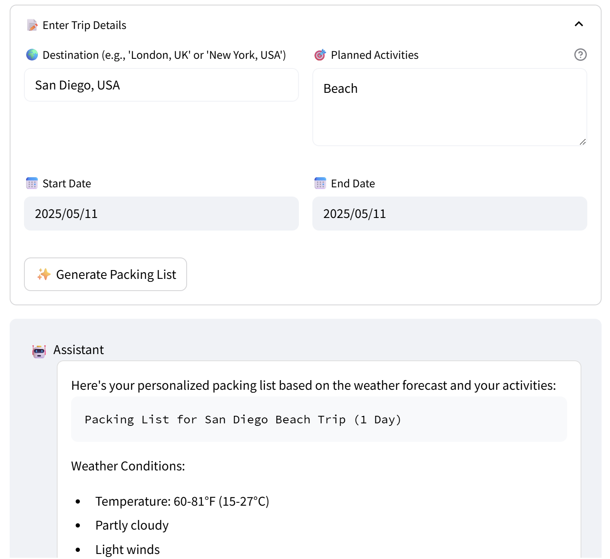
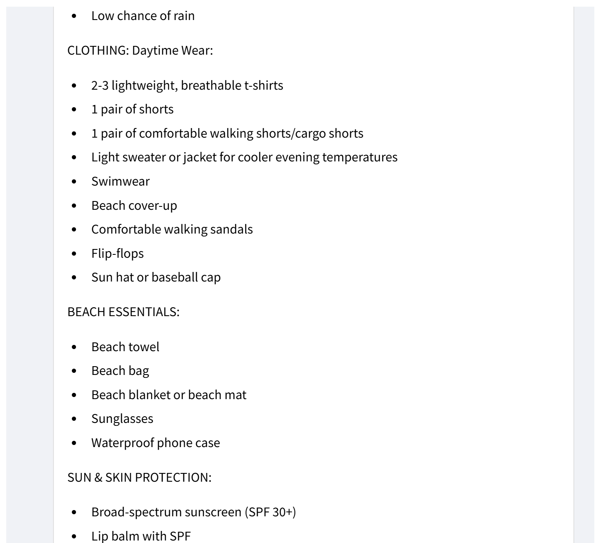

# Travel Packing Assistant

A smart travel packing assistant built with Streamlit and AWS Bedrock's Claude model, integrated with weather data to generate personalized packing lists.

## Features

- Weather-aware packing list generation
- Activity-specific recommendations
- Real-time chat interface for questions
- Persistent chat history during session
- Powered by AWS Bedrock's Claude model
- Responsive design

## Setup

1. Clone this repository
2. Install the required dependencies:
   ```bash
   pip install -r requirements.txt
   ```
3. Create a `streamlit/secrets.toml` file in the root directory and add your AWS credentials:
   ```toml
   [aws]
   aws_access_key_id = "your_access_key_here"
   aws_secret_access_key = "your_secret_key_here"
   aws_region = "your_aws_region_here"  # e.g., us-east-1
   aws_session_token = "your_session_token_here"  # optional

   [weather_api]
   api_key = "your_weather_api_key_here"
   ```
4. Make sure you have access to AWS Bedrock service and the Claude model
5. Run the Streamlit app:
   ```bash
   streamlit run app.py
   ```

## Usage

1. Open your web browser and navigate to the URL shown in the terminal (usually http://localhost:8501)
2. Enter your trip details:
   - Destination
   - Start date
   - End date
   - Planned activities
3. Click "Generate Packing List" to get a personalized packing list
4. Use the chat interface to ask questions about your packing list or get additional recommendations

## Features

- **Weather Integration**: Automatically fetches weather data for your destination and dates
- **Activity-Based Recommendations**: Considers your planned activities when generating the packing list
- **Interactive Chat**: Ask questions about your packing list or get additional recommendations
- **Smart Suggestions**: Uses AI to provide context-aware packing recommendations

## Demo

### 1. Enter Trip Details


### 2. Packing List Result


### 3. Detailed Packing List


## Note

Make sure you have:
- Valid AWS credentials with access to Bedrock service
- Sufficient permissions to invoke Bedrock models
- Access to the Claude model in your AWS region
- Internet connection for weather data fetching 